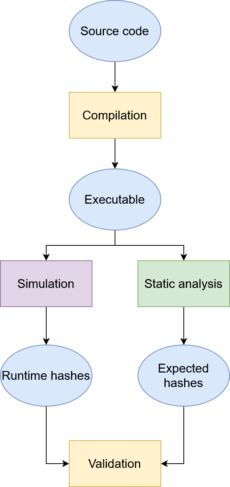

# VoCFI - Verification of Control Flow Integrity

**VoCFI** (Verification of Control Flow Integrity) is a system designed to detect control-flow hijacking attacks, such as Return-Oriented Programming (ROP), by cryptographically attesting the execution path of a program. The project combines a statically computed Control-Flow Graph (CFG) with runtime path attestation using a modified Spike RISC-V simulator.

## 📋 Table of Contents
- [Overview](#-overview)
- [Architecture](#%EF%B8%8F-architecture)
- [Project Structure](#-project-structure)
- [Prerequisites](#%EF%B8%8F-prerequisites)
- [Installation & Setup](#-installation--setup)
- [Usage](#-usage)
- [Sample Programs](#-sample-programs)
- [Components](#-components)
- [Results & Validation](#-results--validation)
- [Related Work](#-related-work)

## 📖 Overview

VoCFI operates in three phases to ensure program execution integrity:

1.  **Static Analysis Phase**: Analyzes a program's RISC-V ELF binary to construct a Control-Flow Graph (CFG) and calculate cryptographic hashes for all possible valid execution paths.
2.  **Runtime Attestation Phase**: Uses a modified Spike simulator (`sniffer` module) to execute the program while monitoring all control-flow transfers and generating a real-time hash of the taken path.
3.  **Verification Phase**: Compares the runtime attestation hash against the set of statically computed valid hashes. A mismatch indicates a control-flow integrity violation.

## 🏗️ Architecture

The VoCFI system follows this workflow:

  

## 📁 Project Structure

    VoCFI/
    ├── README.md                          # This file
    ├── SamplePrograms/                    # Test programs with various control flow patterns
    ├── StaticAnalyzer/                    # Core static analysis module
    ├── Scripts/                           # Automation and orchestration scripts
    └── Validator/                         # Hash comparison module
    

## ⚙️ Prerequisites

- **RISC-V Toolchain**: riscv32-unknown-elf-gcc, riscv32-unknown-elf-g++
- **Spike RISC-V Simulator**: With VoCFI modifications [riscv-isa-sim](https://github.com/loris223/riscv-isa-sim)
- **Proxy Kernel (pk)**: For Spike execution environment
- **Python 3.8+**: With packages: capstone, lief, typeguard
- **Radare2**: For address extraction (extract_addresses.sh)
- **Bash shell**: For script execution

## 🔧 Installation & Setup

### 1. Clone the Repository

    git clone https://github.com/loris223/VoCFI.git
    cd VoCFI

### 2. Install Python Dependencies

    pip install capstone lief typeguard

### 3. Set Up RISC-V Environment

Make sure you have:
- **RISC-V toolchain** ([riscv32-unknown-elf-gcc](https://github.com/riscv-collab/riscv-gnu-toolchain))
- **Modified Spike simulator** with VoCFI sniffer ([riscv-isa-sim](https://github.com/loris223/riscv-isa-sim))
- **Proxy Kernel** for execution environment ([riscv-pk](https://github.com/riscv-software-src/riscv-pk))

## 🚀 Usage

### Quick Start

The main orchestration script handles the entire verification pipeline:

    cd Scripts
    ./orchestrate_all.sh

### Step-by-Step Execution

1. **Configure the target program**:

       ./conf_script.sh
       # Follow prompts to select a sample program

2. **Run the complete verification pipeline**:

       ./orchestrate_all.sh --display-source

3. **Or run individual components manually**:

   - **Compile a program**:

         ./compilation_script.sh ../SamplePrograms/SimpleCondition/main.c

   - **Run static analysis**:

         cd ../StaticAnalyzer
         python3 analyzer.py /path/to/compiled/program

   - **Extract function addresses**:

         cd ../Scripts
         ./extract_addresses.sh /path/to/compiled/program

   - **Execute with modified Spike**:

         ./spike_run_script.sh /path/to/compiled/program

   - **Validate results**:

         cd ../Validator
         python3 validator.py

## 📊 Sample Programs

The `SamplePrograms/` directory contains test cases covering various control flow patterns:

- **SimpleCondition**: Basic if-else branching
- **DoubleIf**: Nested conditional statements
- **SimpleLoop**: Basic for-loop structure
- **NestedLoop**: Nested loop example
- **LoopBreak**: Loop with break statement
- **ComplexLoopCondition**: Loop with multiple conditions

Each program tests specific aspects of the control flow analysis and attestation system.

## 🧩 Components

### 1. Static Analyzer (`StaticAnalyzer/`)

The static analysis module performs the following tasks:

- **ELF Parsing**: Extracts `.text` section and function symbols using `lief`
- **Disassembly**: Uses Capstone to decode RISC-V instructions
- **CFG Construction**: Identifies basic blocks and control flow edges
- **Loop Detection**: Identifies loops through backward jump analysis
- **Path Enumeration**: Generates all possible execution paths
- **Cryptographic Hashing**: Computes BLAKE2 hashes for each valid path

### 2. Spike Modification

The runtime monitoring module integrated into Spike:

- **Instruction Monitoring**: Intercepts all control-flow instructions
- **Path Tracking**: Maintains execution path using a stack-based approach
- **Loop Handling**: Special handling for loop iterations to prevent path explosion
- **Hash Computation**: Real-time BLAKE2 hash chaining of control-flow transfers

### 3. Orchestration Scripts (`Scripts/`)

Automation scripts that coordinate the entire verification process:

- **`orchestrate_all.sh`**: Main pipeline script
- **`compilation_script.sh`**: Compilation utilities
- **`extract_addresses.sh`**: Function boundary detection using Radare2
- **`spike_run_script.sh`**: Spike execution wrapper

### 4. Validator (`Validator/`)

Compares runtime attestation with static analysis results:

- **Hash Comparison**: Verifies runtime hash against valid hash set
- **Loop Validation**: Validates loop execution patterns
- **Result Reporting**: Clear pass/fail reporting

## ✅ Results & Validation

The system outputs verification results indicating whether the program executed according to its expected control flow:

    SUCCESS: Main path hash in sniffer_output is valid!
    SUCCESS: All loop hashes in sniffer_output are valid!

Or in case of a modified control-flow:

    FAILURE: Main path hash in sniffer_output is not valid!
    FAILURE: sniffer_output contains invalid loop hashes!

## 📚 Related Work

VoCFI builds upon research in control-flow integrity and attestation:

- **Control-Flow Integrity (CFI) Principles**: Foundational work by Abadi et al.
- **C-FLAT**: Control-flow attestation for embedded systems
- **LO-FAT**: Low-overhead control flow attestation in hardware
